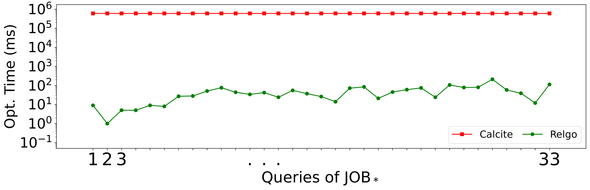

## 1. 背景

在数据管理和分析领域，关系型数据库一直是结构化数据存储和检索的基石，支撑了大量现实应用，在金融、医疗、物流等场景中承担着至关重要的作用。为了方便数据库使用者使用数据库进行创建和检索等任务，结构化查询语言SQL（Structured Query Language）应运而生，且已被各种关系行数据库管理系统（Relational Database Management System, RDBMS）广泛采用。以下是使用SQL查询在IMDB数据上进行查询的一个例子：

```
查询1: Q1

SELECT n.name 
FROM NAME AS n1,
     CAST_INFO AS ci1,
     CAST_INFO AS ci2,
     TITLE AS t1,
     TITLE AS t2,
     MOVIE_COMPANIES AS mc1,
     MOVIE_COMPANIES AS mc2,
     COMPANY_NAME AS cn
WHERE n1.id = ci1.person_id
      AND ci1.movie_id = t1.id
      AND t1.id = mc1.movie_id
      AND mc1.company_id = cn.id
      AND n1.id = ci2.person_id
      AND ci2.movie_id = t2.id
      AND t2.id = mc2.movie_id
      AND mc2.company_id = cn.id
      AND t1.title <> t2.title;
```

IMDB中与该查询相关的表之间的关联如以下ER图所示：

其中，NAME表和TITLE表中分别存储了人和电影的相关信息，CAST_INFO存储了人/电影/角色（在电影中扮演的角色）/职业（例如演员、导演、编剧等)之间的四元关系，COMPANY_NAME中存储了电影公司的名字，而MOVIE_COMPANIES表中存的则是电影/电影公司/公司类型三者之间的关联。因此，上述SQL查询查找的是那些参与制作同一个公司至少两部电影的人。容易发现，使用SQL语句来描述查询内容有时会使得查询语句非常冗长，尤其是当查询中需要描述表与表之间的关系的时候。

另一个更直观的例子是查找n个互相认识的人。由于每次描述两个人之间的互相认识的关系时，就需要增加两个join条件，例如

```
Person1.id = Knows.person1id AND Person2.id = Knows.person2id
```
则描述n个互相认识的人至少要写n*(n-1)个join条件。人工去写这样的查询语句显然效率是很低的。

当查询中需要描述表与表之间的关联时，用图查询来进行描述是相对更方便的。其优势在于可以用图模式的方式来描述查询，我们以Cypher为例，查询Q1可以表示为：
```
MATCH (n1:NAME)-[ci1:CAST_INFO]->(t1:TITLE)-[mc1:MOVIE_COMPANIES]->(cn:COMPANY_NAME),
      (n1)-[ci2:CAST_INFO]->(t2:TITLE)-[mc2:MOVIE_COMPANIES]->(cn)
WHERE t1.title <> t2.title
RETURN n1.name;
```
该查询直观地描述了如下图模式：

对于查找n个互相认识的人的场景，使用图查询时只需要描述包含n个节点的完全图即可（即n-clique）。
上述例子表明，使用图查询能够大大节省数据库使用者写SQL的时间，更快速地表达其想进行的查询。

因此，在ISO SQL:2023中新增了扩展SQL/PGQ (SQL/Property Graph Queries)，以支持在SQL表达式中进行图查询。假定Q1中的NAME、TITLE和COMPANY_NAME表中每个元组表示一个节点，假定CAST_INFO和MOVIE_COMPANIES表中的每个元组表示一条边，可以将Q1改写为如下SQL/PGQ查询：

```
SELECT n_name FROM GRAPH_TABLE (G
    MATCH (n1:NAME)-[ci1:CAST_INFO]->(t1:TITLE)-[mc1:MOVIE_COMPANIES]->(cn:COMPANY_NAME),
      (n1)-[ci2:CAST_INFO]->(t2:TITLE)-[mc2:MOVIE_COMPANIES]->(cn)
    WHERE t1.title <> t2.title
    COLUMNS (n1.name AS n_name) 
) g;
```

上述SQL/PGQ扩展解决了如何在SQL表达式中写图查询的问题，但是在获取SQL/PGQ的查询语句之后，如何针对其进行分析和优化仍然是SQL/PGQ带来的一个新的问题。查询优化指的是根据用户给定的查询找到高效的查询计划，以达到更优的查询性能。关系数据库查询优化器的相关研究工作通常是针对SPJ查询框架（selection-projection-join）开展的。而对于SQL/PGQ语句而言，传统的SPJ查询框架无法直接描述语句中的图查询部分（即GRAPH_TABLE (...)部分）。因此，难以直接使用传统的关系数据库的优化器来优化SQL/PGQ语句。
对于该问题，我们首先重新定义了查询框架，随后基于GOpt设计并实现了名为RelGo的统一优化框架。
我们的主要贡献可以总结如下：

1. 我们定义RGMapping来根据SQL/PGQ的语句将关系数据模型映射到属性图模型。基于RGMapping，我们定义了新的查询框架SPJM。SPJM能被用于分析同时包含关系和图查询的查询表达时。
2. 我们构建了将SPJM查询转化为SPJ的相关理论。基于该理论，可以将SPJM查询转化为SPJ查询，从而使得现有关系数据库能直接处理SPJM查询。这种方法称为图无关方法（graph-agnostic approach）。我们证明了这种图无关的方法在一些场景下有巨大的搜索空间（指数级地大于我们的方法的搜索空间）。
3. 我们设计并实现了RelGo以同时利用关系数据库中的查询优化器（简称为关系优化器）和图数据库中的查询优化器（简称为图优化器）来优化SPJM查询。RelGo使用了当前最优的图优化技术，并基于图索引实现了图相关的物理操作。
4. 我们将RelGo和现有的工业级关系优化框架Calcite相结合，并使用DuckDB作为执行引擎。在LDBC benchmark上的实验结果表明在使用图索引的情况下，RelGo相比于图无关方法能取得平均21.9倍的速度提升。当基准方法能够使用图索引时，RelGo仍然能取得平均5.4倍的提升。

## 2. 数据模型和SPJM查询框架
我们先简单说明本文会用到的一些概念，包括属性图（Property Graph）和RGMapping。

### 2.1 数据模型
给定一个同时包含关系查询和图查询的表达式中，为了能够将两者的查询计划整合起来，需要定义关系数据与图数据之间的转化方式。因此，我们用到了如下概念。

<u>**属性图**</u>

属性图是由节点和边构成的图结构，其中，节点和边可以具有若干属性。图3(a)的右上角给出了一个属性图的例子。该属性图中共包含5个节点，其中有3个Person节点和2个Message节点。此外，该属性图中还包含8条边，分别具有Knows和Likes的标签。

<u>**RGMapping**</u>
RGMapping将关系表中的元组映射到属性图中的节点或边。
具体地，RGMapping包含一个节点映射和一个边映射，它们分别将表中的元组映射到不同的节点和边。为了更方便地描述RGMapping的定义，我们结合如下图来进行叙述。

<p align="center">
  
  
  
</p>
图3(a)中包含四个关系表，分别为Knows, Person, Likes和Message。它们之间的关联可以用图中左下角的ER图进行描述。具体地，ER图中包含实体和关联，而表示实体的那些关系表中的元组可以被映射为图中的节点，表示关联的关系表中的元组则可被映射为图中的边。该例子中，表Person和Message中的元组被映射为节点，表Knows和Likes中的元组被映射为边。映射得到的属性图如图3(a)右上角的属性图G所示。**属性图中p1表示Person表中person_id为1的元组，k1表示Knows表中knows_id为1的元组**。RGMapping就是用来定义关系表和属性图之间的映射关系的。为便于说明，后文称映射到节点的表和映射到边的表分别为点表和边表。对于边表而言，仅仅知道一个元组和边之间的映射关系是不够的，还需要知道边的起点和终点与点表之间的关联关系。
具体来说，针对该例子中的边表Likes，我们能给出如下两个关联关系：
$$
{Likes}^s: Likes \rightarrow Person \qquad (Likes.pid = Person.person\_id)
$$
$$
{Likes}^t: Likes \rightarrow Message   \qquad (Likes.mid = Message.message\_id)
$$
这两个关联关系分别表明了，对于Likes表中的一个元组，其对应属性图中的一条边，边的起点与点表Pesron中的一个元组对应，终点与点表Message中的一个元组对应。元组间的对应关系根据属性Likes.pid, Person.person_id和Message.message_id的值判断。具体地，Likes表中的元组与Person中的元组之间有关联，当且仅当Likes表中元组的pid属性的值与Person表中元组的person_id属性的值相同。例如，Likes表中的第1行与Person表中的第1行有关联。通常来说，可以根据关系表之间的主外键关联来给出上述关联关系。具体来说，因为Likes表中有指向Person和Message的外键pid和mid，所以Likes关联的点表是Person和Message。


知道如上信息后，即可进行关系表与属性图中节点和边的相互转化。因此，当使用关系数据库存储数据时，只要定义了相应的RGMapping，就可以将部分关系表转化为属性图，从而借助图优化器的能力进行部分图优化。

### 2.2 SPJM查询框架定义
为了表示图查询，我们向关系算子中引入了新的算子，即匹配算子（Matching Operator）。该算子接受一个图关系表和一个模式图作为输入，以一个图关系表作为输出。这里，图关系表是一类特殊的表。该表中的每个元组表示一个属性图，元组的每个属性的值为节点或边。图3(b)下方的表即为一个图关系表。

对于输入的图关系表中的每个元组（即属性图），匹配算子查找其所有与输入的模式图同构的子图。匹配算子返回的图关系表的每一行对应一个这样找到的同构子图。本文中，我们考虑的查询包括选择（Selection）、投影（Projection）、联结（Join）和匹配（Match）算子，这些算子构成的查询称为SPJM查询。


## 3. 针对匹配算子的优化
本节中我们具体讨论如何对匹配算子进行优化。具体地，可以从逻辑变换（logical transformation）和物理实现（physical implementation）两方面进行优化。逻辑变换优化需要将匹配算子转化为性能更高的逻辑等价的表达，物理实现优化则关注如何高效执行匹配算子。

### 3.1 逻辑变换
给定一个匹配算子，假设其输入的模式图为
```
MATCH (p1:Person)-[e1:Knows]->(p2:Person)-[e3:Likes]->(m:Message),
      (p1)-[e2:Likes]->(m)
RETURN p1.name, p1.place_id, p2.name
```
该模式图如图3(b)中所示，查找两个喜欢相同Message的人。模式图中的表名字母均使用大写，如PERSON。针对该查询，我们提出了两种优化方法，一种是图无关方法（graph-agnostic approach），另一种是图相关方法（graph-aware approach）。

#### 3.1.1 图无关方法
图无关方法根据RGMapping直接将模式图转化为表之间的join，从而将SPJM问题转化为SPJ问题，再使用现有的关系优化器进行查询优化。根据第2节中描述的RGMapping以及图3(a)中描述这些关系表之间关系的ER图，容易得到Person, Message, Knows和Likes表分别映射到图中标签为Person, Message, Knows和Likes的点或边。
并且，点表和边表之间存在如下关联关系：
$$
Likes^s: Likes \rightarrow Person \qquad (Likes.pid = Person.person\_id)
$$
$$
Likes^t: Likes \rightarrow Message \qquad (Likes.mid = Message.message\_id)
$$
$$
Knows^s: Knows \rightarrow Person_1 \qquad (Knows.p1d = Person_1.person\_id)
$$
$$
Knows^t: Knows \rightarrow Person_2 \qquad (Knows.p2d = Person_2.person\_id)
$$
其中，下标为1和2的Person表代表Person表的两个拷贝，与Person表有相同的内容。接着，模式图中的每一条边都可以通过点表和边表之间的join得到。具体地，上述模式图中的边可以转化为如下join：
$$
R'_1 = Person_1 \Join_{person\_id = pid1} Knows \Join_{pid2 = person\_id} Person_2
$$
$$
R'_2 = Person_1 \Join_{person\_id = pid} Likes_1 \Join_{mid = message\_id} Message
$$
$$
R'_3 = Person_2 \Join_{person\_id = pid} Likes_2 \Join_{mid = message\_id} Message
$$
因此，上述匹配操作可以转化为
$$
R'_3 \Join R'_2 \Join R'_1
$$
从而使用关系优化器进行查询优化。

#### 3.1.2 图相关方法
本节我们提出一种图相关方法，从而用图优化的思想来对匹配操作进行优化。具体地，我们首先拆分图3(b)中的模式图，得到如下分解树。

<p align="center">
  
</p>


具体地，分解树中的每个节点都表示输入的模式图自身或其导出子图。分解数的根节点是原模式图，对于树中的每个中间节点，其有两个孩子节点，满足两个孩子节点都是该中间节点的子图，并且将两个孩子节点join起来即得到该中间节点。

分解树的叶子节点必须为最小匹配单元（Minimum Matching Component, MMC）。MMC可以是仅包含一个节点的模式子图（Single-vertex Pattern），也可以是一个完全星型模式子图（Complete-star Pattern）。完全星型模式子图需要位于右子树上，且其所有叶子节点均在左子树中出现。容易发现，仅包含一条边的模式子图（Single-edge Pattern）是一种特殊的完全星型模式子图。如上设计主要是为了保证执行计划是最坏情况最优的（worst-case optimal）。
图4的分解树中共包含三个MMC，分别是$\mathcal{P}_2$ （完全星型模式子图），$\mathcal{P}_3$（仅包含一个节点的模式子图）和$\mathcal{P}_4$（仅包含一条边的模式子图)。完成拆分后，对于分解树中的每个节点，通过join将其左右子节点联结起来，得到当前节点的结果。例如，在匹配图3(a)中属性图G和图4中的模式图时，$\mathcal{P}_1$的匹配结果为(p1, k1, p2), (p2, k2, p1), (p2, k3, p3), (p3, k4, p2)；$\mathcal{P}_2$的匹配结果为(p1, l1, m1, l2, p2), (p2, l2, m1, l1, p1), (p2, l3, m2, l4, p3), (p3, l4, m2, l3, p2)。将它们的结果关于点P1和P2进行join得到(p1, k1, p2, l1, m1, l2), (p2, k2, p1, l2, m1, l1),  (p2, k3, p3, l3, m2, l4)和(p3, k4, p2, l4, m2, l3)。这些结果正是匹配原模式图$\mathcal{P}$ 得到的结果，如图3(b)下方的表格所示。

我们证明了在一些场景下，图相关方法的搜索空间指数级地小于图无关方法。并且我们以RelGo（图相关方法）和Calcite（图无关方法）为例，在LDBC30和JOB benchmark上进行实验比较了它们的优化时间。实验结果表明了RelGo的优化速度相比Calcite实现了巨大提升。

<p align="center">
  
  
</p>

### 3.2 物理实现
物理实现优化指的是在实现上述执行计划中的算子时，使用高效的物理实现来使得实际执行更为高效。参考GRainDB，我们实现了图索引。下图是图索引的一个例子。


可以看到，EV索引建立在边表上。对于边表Likes的每个元组，其增加了两个新的属性列pid_rowid和mid_rowid，记录该边对应的起点和终点在对应点表的位置（行号）。例如，Likes表中第一行(即l1)对应的边的起点位于Person表的第0行，终点位于Message表的第0行。VE索引是基于点表构建的。例如，对于点表Person中的每个元组，VE索引记录了其相邻的边在边表的位置（行号），以及该边的另一个端点在对应点表的位置。具体地，对于Person表位于第0行的元组（即p1），该VE索引记录了其相邻的边在Likes表的第0行，且该边的另一个端点在Message表的第0行。基于这两个索引，在实际join点表和边表时，可以跳过值比较而快速得到能join的元组。

具体地，我们针对分解树主要实现了三种物理实现的优化：
- 给定一个中间节点，当其右子树是仅包含一条边的MMC时，将其左右子树的join实现为EXPAND_EDGE和GET_VERTEX算子的组合，在这两个算子的计算过程中不用将结果展开。例如，考虑图5，假设一棵分解树有一个中间节点(:Person) JOIN (:Person)-[:Likes]->(:Message)，则该节点的左右子树均为MMC，即(:Person)和(:Person)-[:Likes]->(:Message)。假设左子树匹配结果的一个元组为(p2)，则在其与右子树join时，得到的结果为(p2, [l2, l3], [m1, m2])。展开后得到结果(p2, l2, m1)和(p2, l3, m2)。
- 当join的右表是完全星型模式子图时，我们实现了EXPAND_INTERSECT算子，从而尽量在计算过程中不将结果展开。考虑中间节点(:Person)-[:Knows]->(:Person) JOIN (:Person)-[:Likes]->(:Message)<-[:Likes]-(:Person)，即图4中分解树根节点的两个子节点。假设左子树匹配结果的一个元组为(p1, k1, p2)，则EXPAND_INTERSECT算子先分别从p1和p2出发调用EXPAND_EDGE和GET_VERTEX算子，得到未展开的结果(p1, k1, p2, [l1], [m1])和(p1, k1, p2, [l2, l3], [m1, m2])。随后直接在这两个未展开的结果上求交集，得到(p1, k1, p2, [(l1, l2, m1)])。最终展开后得到结果(p1, k1, p2, l1, l2, m1)。
- 尽量在物理实现时使用图索引，以加速点表和边表之间的join。

## 4. 统一优化框架RelGo
本节我们具体介绍提出的统一优化框架RelGo，其优化流程如下所示。


图6中给出了用RelGo优化SPJM查询的一般流程。具体地，RelGo中包含两部分优化，即图优化和关系优化。图优化负责处理SPJM查询中的图查询部分（即匹配算子)，它使用图优化技术找到最优的分解树。而关系优化负责优化查询中的关系查询部分。我们并不严格制定图优化和关系优化的先后顺序，但为了说明方面，我们假定先进行图优化，再进行关系优化的顺序。

RelGo使用GOpt进行图优化，并在优化过程中应用了过滤条件下推规则（FilterIntoMatchRule）和算子融合规则（TrimAndFuseRule）等技术。具体地，算子融合规则指的是当连续执行EXPAND_EDGE和GET_VERTEX算子时，如果不需要获取边上的属性，则这两个算子等价于直接获取邻居节点操作。因此，在构建了相应图索引的情况下，可以利用VE索引将两个算子合并为一个EXPAND算子，直接获取邻居节点。

完成针对匹配算子的图优化后，会得到一个执行计划（记为**PL**），下一步需要结合SPJM查询中剩余的关系算子（如selection，projection等）**PL**和进行综合优化。RelGo使用关系优化器进行这部分优化。在实际实现时，使用的关系优化器是Calcite自带的优化器。
为了避免关系优化与图优化之间的互相干扰，我们提出了一个新的名为SCAN_GRAPH_TABLE的物理算子。如图6(c)所示，该算子包含了执行计划**PL**，且其输出是一个关系表。该算子使得图优化得到的查询计划能够以一个关系表的形式参与到关系优化器的优化中。

RelGo系统是用Java基于Apache Calcite实现的。首先，我们在Calcite的SQL解析器上支持了SQL/PGQ的相关扩展，并且继承了Calcite的RelNode算子以支持SQL/PGQ中的GRAPH_TABLE从句。其次，我们还在Calcite上实现了一些优化规则，包括过滤条件下推和算子融合等。在具体进行优化时，我们使用了GLogue中的高阶数据来提升代价估计的准确度。具体地，高阶数据主要记录了数据集中包含不同节点数量的导出子图的数量。再次，RelGo输出的执行计划用Google Protocol Buffer进行了格式化，其保证了该计划不依赖于任何平台。
我们使用基于C++实现的DuckDB作为后端，并在其上集成了GRainDB中提出的图索引。此外，我们在DuckDB上实现了一种新的join，名为EI-Join，以支持EXPAND_INTERSECT算子。当不存在相应的图索引时，我们会在查询计划中默认使用HASH_JOIN。


## 5. 实验验证

为了验证RelGo产生的查询计划的质量，我们使用了LDBC和IMDB两个数据集，在LDBC SNB和JOB两个benchmark上进行了性能测试。其中，LDBC数据集是官方生成器生成的，scale factor为10，30和100。JOB benchmark在IMDB数据集上进行查询。测试中比较的基准方法包括：

- DuckDB：常用关系型数据库，使用图无关方法进行优化
- GRainDB：在DuckDB上实现了图索引，使用DuckDB的优化器优化查询后，将一些join算子替换为使用图索引的predefined join
- Umbra：其查询优化器能生成包含worst-case optimal join的查询计划。
- Kùzu: 使用属性图模型的图数据库管理系统

性能比较的结果如下图所示：

<p align="center">
  
  
  
  
  
</p>

实验结果表明，在LDBC100数据集上，RelGo生成的查询计划相比DuckDB、GRainDB、Umbra和Kùzu生成的查询计划，平均执行时间分别快